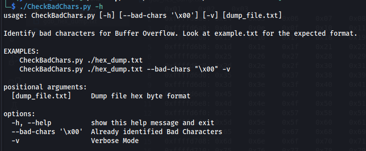
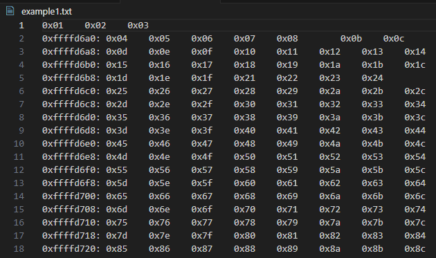

# Buffer Overflow Identify Bad Characters
Python script for identifying bad characters in Buffer Overflow during the stage of shellcode generation.

## Usage Examples
It's a mix of manual and automation to help you identify bad characters faster while minimizing human error. Once you identified a bad character, e.g. '\x09' replaced with '\x00', add '\x09' to the list and remove '\x00' from the dump file. Repeat the process until all bad characters are identified.  

<video controls src="Images/demo.mp4" title="Title"></video>

## Expected Formats
### GDB Debugger Format

### Hex Dump Format
](Images/hex_dump.png)